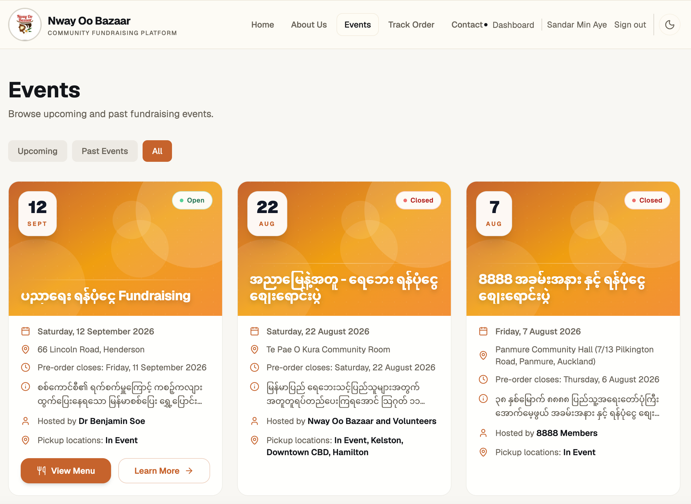
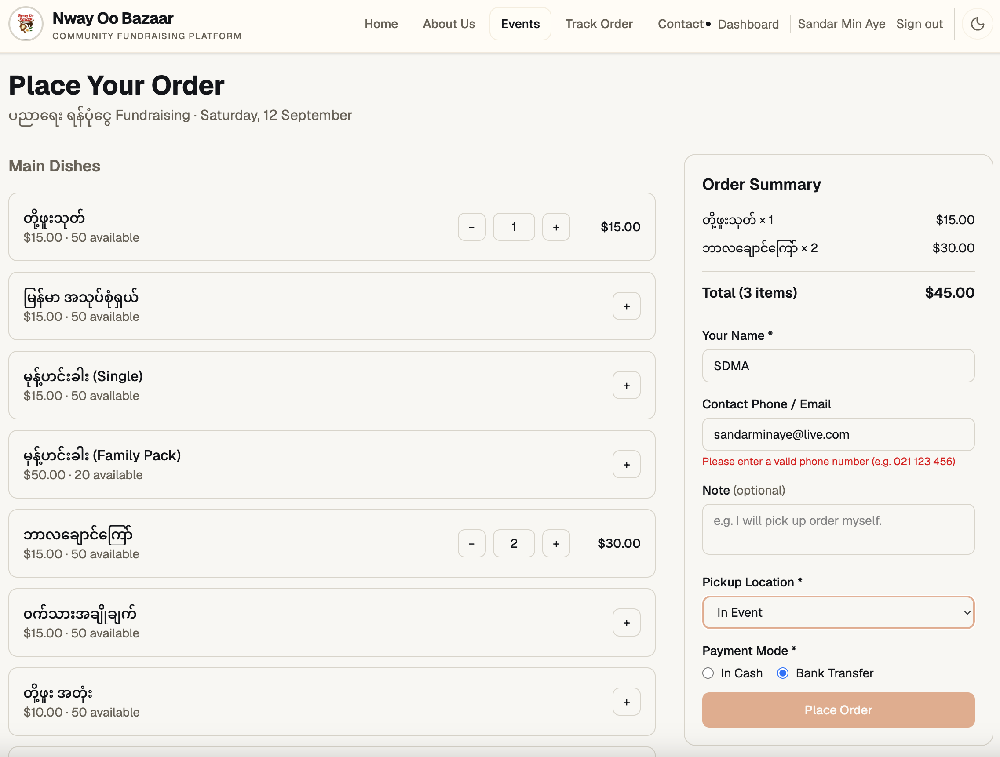
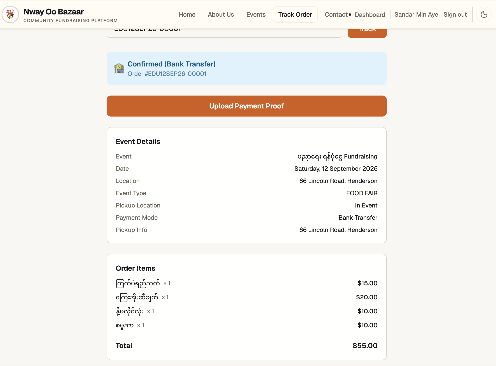
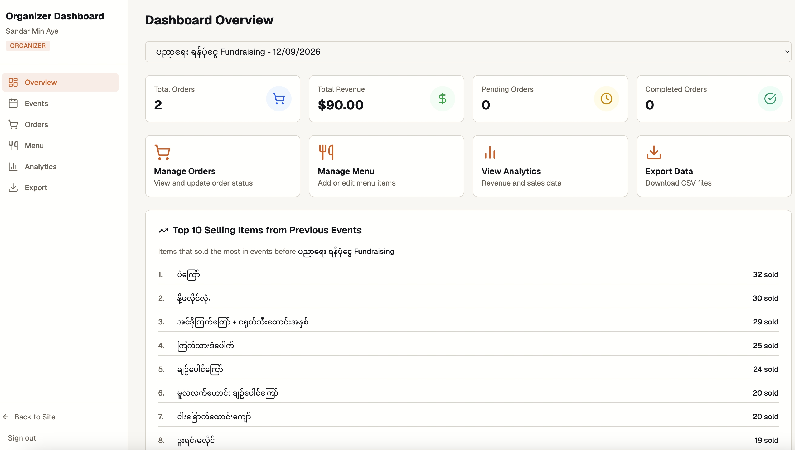
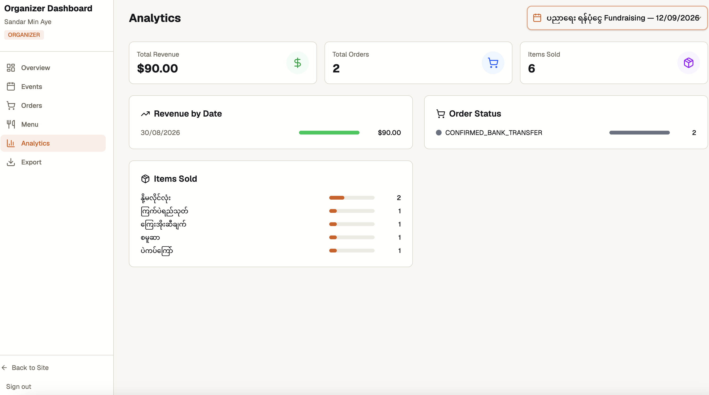
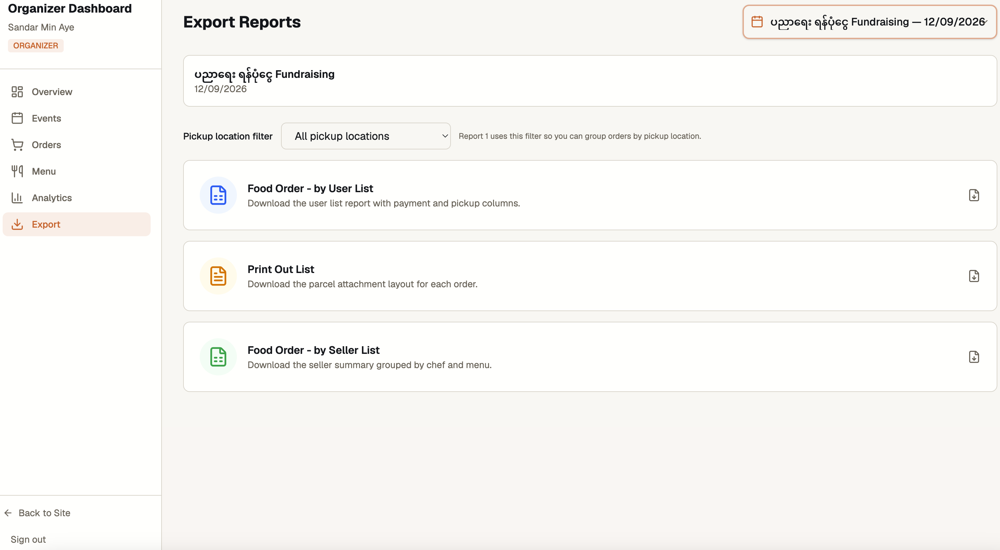
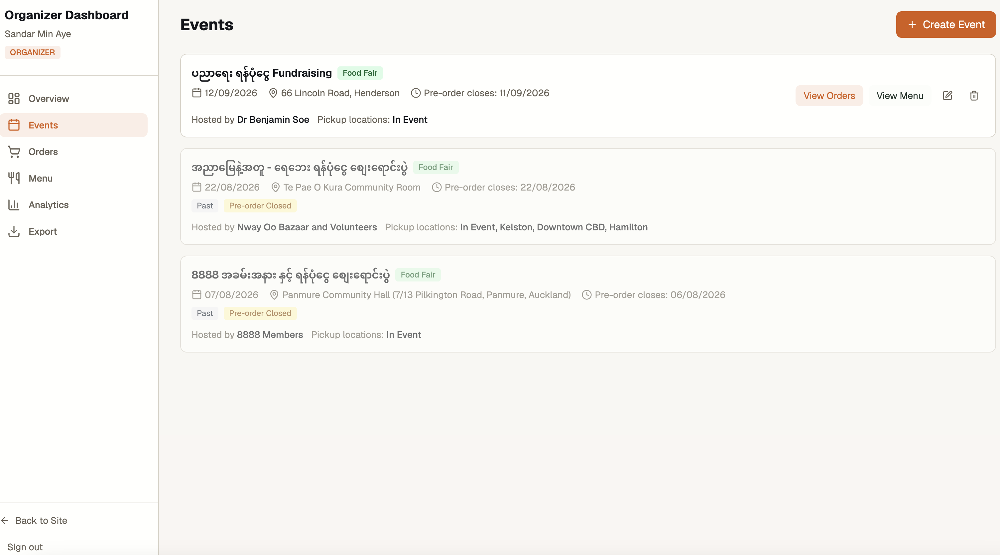
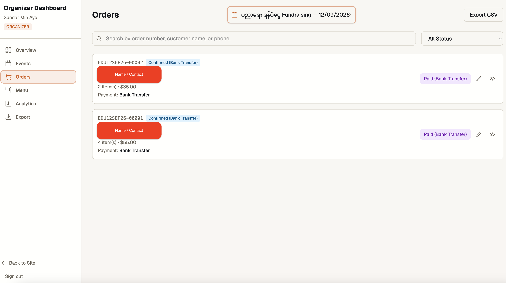
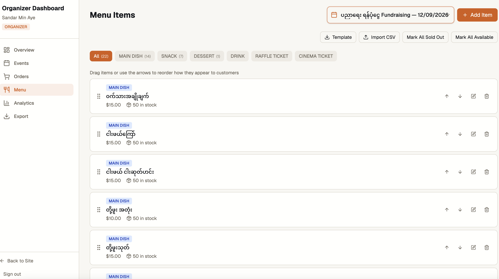

# Nway Oo Bazaar

A full-stack web-based preorder management platform for community fundraising events in New Zealand. Built to help Myanmar community organizations manage food orders, payment confirmations, and event pickups.

**🔗 Live URL:** [nwayoobazaar.netlify.app](https://nwayoobazaar.netlify.app)

---

## Screenshots

| Homepage                              | Menu Ordering                         | Order Tracking                              |
| ------------------------------------- | ------------------------------------- | ------------------------------------------- |
|  |  |  |

| Dashboard                               | Analytics                               | Export                            |
| --------------------------------------- | --------------------------------------- | --------------------------------- |
|  |  |  |

| Event Management                  | Orders Management                 | Items Management                     |
| --------------------------------- | --------------------------------- | ------------------------------------ |
|  |  |  |

---

## Key Features

### For Customers

- **Browse Events** — View upcoming fundraising events with details
- **Pre-order Food** — Select items from menu, choose pickup location
- **Order Tracking** — Track order status in real-time
- **Payment Upload** — Upload bank transfer screenshots

### For Organizers

- **Event Management** — Create events with code prefixes for order numbering
- **Menu Management** — Drag & drop reordering, CSV import/export
- **Order Management** — Update status, edit orders, process payments
- **Export Reports** — User list, seller list, print out list (CSV)
- **Analytics** — Revenue, items sold, payment modes, category breakdown
- **Historical Insights** — Top 10 selling items from previous events

### For Admins

- **User Management** — Invitation-based registration system
- **Role-based Access** — Admin and Organizer roles with different permissions
- **Dashboard Overview** — Stats, quick actions, historical data

---

## Tech Stack

| Layer        | Technology                                |
| ------------ | ----------------------------------------- |
| **Frontend** | React 19, TypeScript, TailwindCSS, Vite   |
| **Backend**  | Express.js, TypeScript, Prisma ORM        |
| **Database** | MySQL (Aiven)                             |
| **Storage**  | Amazon S3 (payment screenshots)           |
| **Hosting**  | Netlify (Frontend + Serverless Functions) |
| **CI/CD**    | GitHub Actions, Husky, lint-staged        |

---

## Architecture

```
┌─────────────────────────────────────────────────────────────┐
│                       Frontend (React)                       │
│  Pages: Home, Events, Menu, Orders, Dashboard, Analytics    │
│  Components: EventCard, OrderEditModal, ExportPage          │
└──────────────────────────┬──────────────────────────────────┘
                           │ API calls
                           ▼
┌─────────────────────────────────────────────────────────────┐
│                  Backend (Express + Prisma)                   │
│  Controllers → Services → Repositories → Prisma → MySQL     │
│  Features: Auth, Events, Menu, Orders, Exports              │
└──────────────────────────┬──────────────────────────────────┘
                           │
                    ┌──────┴──────┐
                    ▼             ▼
               ┌─────────┐  ┌─────────┐
               │  MySQL  │  │   S3    │
               │ (Aiven) │  │ (AWS)   │
               └─────────┘  └─────────┘
```

---

## Project Structure

```
Nway-Oo-Bazaar/
├── app/
│   ├── packages/
│   │   ├── client/          # React frontend
│   │   │   └── src/
│   │   │       ├── pages/       # Page components
│   │   │       ├── components/  # Reusable components
│   │   │       └── lib/         # Utilities, API config
│   │   └── server/          # Express backend
│   │       ├── controllers/     # Request handlers
│   │       ├── services/        # Business logic
│   │       ├── repositories/    # Database queries
│   │       └── prisma/          # Schema, migrations
│   └── package.json         # Workspace config
├── .github/                 # CI/CD workflows
├── screenshots/             # App screenshots
└── README.md
```

---

## Getting Started

### Prerequisites

- Node.js v20+
- MySQL database
- AWS S3 bucket (for file uploads)

### Installation

```bash
# Clone the repository
git clone https://github.com/sandarma/Nway-Oo-Bazaar.git
cd Nway-Oo-Bazaar

# Install dependencies
cd app && npm install

# Set up environment variables
cp ../.env.example app/packages/server/.env
# Edit .env with your credentials

# Run database migrations
cd packages/server && npx prisma migrate dev

# Start development servers
cd .. && npm run dev
```

The app will be available at:

- Frontend: `http://localhost:5173`
- Backend: `http://localhost:3000`

---

## Environment Variables

| Variable                   | Description             |
| -------------------------- | ----------------------- |
| `DATABASE_URL`             | MySQL connection string |
| `MY_AWS_REGION`            | AWS region for S3       |
| `MY_AWS_ACCESS_KEY_ID`     | AWS access key          |
| `MY_AWS_SECRET_ACCESS_KEY` | AWS secret key          |
| `MY_AWS_S3_BUCKET_NAME`    | S3 bucket name          |

---

## Key Technical Decisions

### 1. Serverless Deployment

Backend deployed as Netlify Functions using `serverless-http`, allowing Express to run serverlessly without cold start issues.

### 2. S3 Proxy Pattern

Payment screenshots stored in private S3 bucket, accessed via `/api/s3/:key` proxy endpoint. Keeps bucket secure while allowing authorized access.

### 3. Event Code Prefix

Order numbers use event-specific prefixes (e.g., `8888-00001`) instead of date-based format. Enables unique order numbering across events.

### 4. Drag & Drop Menu Ordering

Menu items use `orderIndex` field for display ordering. Organizers can drag & drop to reorder items as they appear to customers.

### 5. Historical Analytics

Dashboard shows top 10 selling items from previous events, helping organizers plan menus based on past performance.

---

## Challenges & Solutions

| Challenge                     | Solution                                     |
| ----------------------------- | -------------------------------------------- |
| Cold starts on serverless     | Used `serverless-http` with Express          |
| Private S3 bucket access      | Built proxy endpoint with auth               |
| Menu ordering flexibility     | Added drag & drop with orderIndex            |
| Order numbering across events | Implemented event code prefix system         |
| Historical data insights      | Added top selling items from previous events |

---

## What I Learned

- **Full-stack development** — Building end-to-end features from database to UI
- **Serverless architecture** — Deploying Express apps as serverless functions
- **AWS S3 integration** — Secure file uploads with proxy pattern
- **Real-time stock management** — Transactional order processing
- **Role-based access control** — Admin and Organizer permissions

---

## Future Improvements

- [ ] AI Chatbot for conversational ordering (GPT-4o-mini)
- [ ] Real-time order notifications (WebSocket)
- [ ] Multi-language support (Myanmar/English)
- [ ] Mobile-responsive optimizations
- [ ] Email/SMS order confirmations
- [ ] Advanced analytics dashboard

---

## Author

**Sandar Min Aye**

- GitHub: [@sandarma](https://github.com/sandarma)
- LinkedIn: [Sandar Min Aye](https://www.linkedin.com/in/sandar-min-aye/)

---

## License

This project is licensed under the MIT License - see the [LICENSE](LICENSE) file for details.
